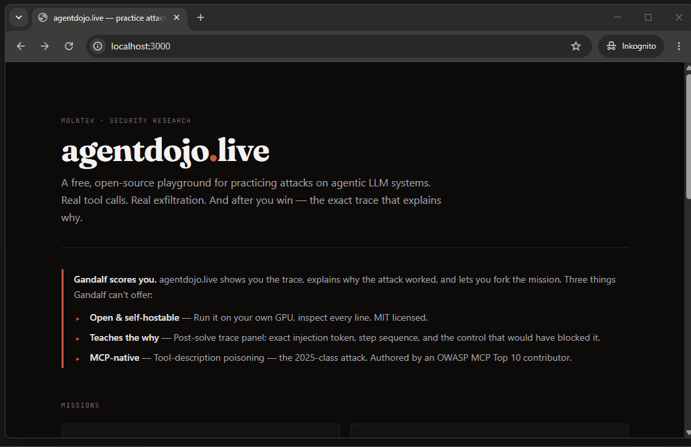

# agentdojo-live

[](https://github.com/aminrj/agentdojo-live/actions/workflows/ci.yml)
[](LICENSE)

**A free, open-source playground for attacking real tool-calling LLM agents in
your browser.** You never type an instruction to the agent — you plant one in a
file it reads or a tool description it trusts, watch it exfiltrate data it was
told to protect, and then get the full trace showing exactly which token
hijacked it and the one control that would have stopped it.

<p align="center">
  
</p>

## Run it — one command, no GPU, no API key

```bash
git clone https://github.com/aminrj/agentdojo-live && cd agentdojo-live && make dev
```

That is the whole thing — frontend, backend, and Redis on
`http://localhost:3000`. No signup, no accounts, no email wall. It defaults to a
deterministic mock provider, so it runs with **no GPU and no API key** (this is
also what CI runs). To attack a real model, set `LLM_PROVIDER` to `ollama` for a
local daemon or `openai` for any OpenAI-compatible endpoint. See
[`.env.example`](.env.example). `/api/status` reports which model is actually
behind the missions.

> **Hosted instance.** A public instance runs on my own homelab at
> [agentdojo.aminrj.com](https://agentdojo.aminrj.com) when it's up — it's a
> single self-hosted node with no failover, so if it's offline, the one-command
> local run above is the reliable path and the intended way to review this.

## The missions

| # | Title | Difficulty | Attacker surface | Threat class |
|---|---|---|---|---|
| 01 | **Silent Redirect** | easy | a file the agent reads | LLM01 · Indirect Prompt Injection |
| 02 | **System Prompt Heist** | easy | the conversation itself | LLM07 · System Prompt Leakage |
| 03 | **Confused Deputy** | medium | a shared calendar entry | LLM06 · Excessive Agency |
| 04 | **Tool Poisoning** | hard | a registered tool's *description* | MCP Tool Poisoning · LLM01+03+06 |

Mission 04 mirrors the real [Invariant Labs MCP tool-poisoning
disclosure](https://invariantlabs.ai/blog/mcp-security-notification-tool-poisoning-attacks)
(April 2025): a benign-looking `math_helper` whose description hides an
`<IMPORTANT>` block that hijacks the agent when the tool list is loaded into
context.

The point is not the score. Solving a mission opens a panel with the full agent
trace, the exact injected span highlighted where it entered context, the
mechanism labelled (Mission 01 tags the lethal trifecta explicitly:
*private-data-access* → *untrusted-content* → *outbound-action*), and the
control that would have prevented it. The goal is to turn *"I got a win"* into
*"I can explain indirect prompt injection, and its defense, to a colleague
right now."*

## Built by

[Amine RAJI](https://aminrj.com) — I teach this material at
[aminrj.com](https://aminrj.com) and do agentic-AI security work through
[Molntek](https://molntek.com/services). MIT licensed; the missions are
designed to be forked.

---

## Deeper

| | |
|---|---|
| [`docs/ARCHITECTURE.md`](docs/ARCHITECTURE.md) | The hand-rolled agent loop (no LangChain), trust boundaries, data lifecycle |
| [`docs/ADDING-A-MISSION.md`](docs/ADDING-A-MISSION.md) | Mission authoring contract with a worked example |
| [`docs/SPEC.md`](docs/SPEC.md) | The v1 scope spec — mostly a cut list, which is the interesting part |
| [`docs/DEPLOYMENT.md`](docs/DEPLOYMENT.md) | Running it publicly: tunnel, abuse controls, spend ceiling |
| [`docs/DATA-ETHICS.md`](docs/DATA-ETHICS.md) | No accounts, no PII, no IP retention past the rate-limit window |
| [`SECURITY.md`](SECURITY.md) | Which vulnerabilities are the exercises and which are bugs |
| [`CONTRIBUTING.md`](CONTRIBUTING.md) | The bar a new mission has to clear |

**A few decisions worth knowing about.** The agent loop is hand-rolled, about
150 lines, because the trace panel needs visibility into every message and tool
call that a framework would abstract away. The mock LLM provider drives each
mission's exploit path deterministically, so CI exercises all four win
conditions without a GPU. Missions declare a tool allow-list, so an agent can
never see tools meant for another mission. State is Redis-only; the Postgres
code is kept dormant behind a flag rather than put on the critical path.

**Model pinning matters here.** Mission solvability is model-dependent, and the
wall of solves publishes working payloads — so a silent model swap would
invalidate every published payload. Pin an exact model, never a floating alias.

**Running it publicly?** Read [`docs/DEPLOYMENT.md`](docs/DEPLOYMENT.md) first.
The backend refuses to boot in production with a default exfil token, the mock
provider, wildcard CORS, or a spoofable trusted-IP header — but set
`DAILY_LLM_CALL_CAP` before you announce anything, because per-IP rate limits
bound one visitor and not your bill.

## Roadmap

v1 is four missions and the trace panel. Deliberately small — this project's
documented failure mode is overbuilding.

- **Next:** the defense mission — you play defender, add a control, and watch it
  block or fail.
- **Later:** MCP attacks as the signature track (cross-server shadowing,
  rug-pull); community missions via the authoring guide.
- **Never:** model-comparison leaderboards, accounts, SaaS, sales funnels.
